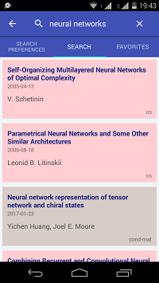
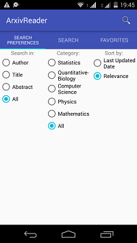
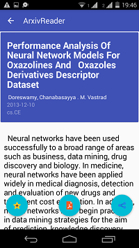

# ArXivXplorer
Capstone Project for Udacity Android Nanodegree

## Description

Explore the world of arXiv.org from Cornell University Library with open access to 1-million+
e-prints in Physics, Mathematics, Computer Science, Quantitative Biology, Quantitative Finance
and Statistics

## Intended User

Students, Researchers. Scientists & Academicians from Physics, Mathematics, Computer
Science, Quantitative Biology, Quantitative Finance and Statistics background.

## Features

* Search options to explore published works on arxiv.org
* Advanced Search for shortlisting based on authors, categories, published date etc.
* Download and view e-paper PDF
* Tag favorites to view and search later.
* Widget for quick access
* Voice to text for search

## Screenshots

